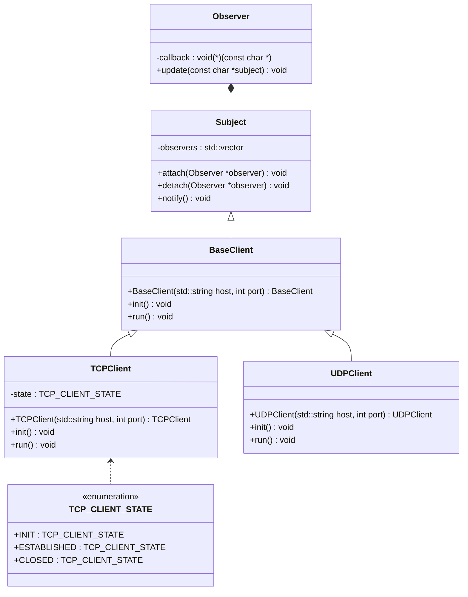

# IPKCPC - IPK Calculator Protocol Client in C++

## Description

Client is using TCP or UDP protocol to communicate with server. It is able to send simple mathematical expressions to
server and receive result.

Project is using Observer design pattern to notify user about received data.

Sending and receiving data is implemented using threads (`fork`).

## Classes of the project



### Observer

Observer is an interface which is used to notify user about received data.
It has one method `update` which is called when new data is received.
It has one attribute `callback` which is a pointer to function which is called when new data is received.

### Subject

Subject is an interface which is used to notify observers about new data.
It has one attribute `observers` which is a vector of pointers to observers.
It has three methods `attach`, `detach` and `notify` which are used to manage observers.

### BaseClient

BaseClient is an abstract class which is used to implement common methods for TCP and UDP clients.
It extends `Subject` class, so it can have attached observers, which are notified when new data is received.
It has two attributes `host` and `port` which are used to connect to server.
It has two methods `init` and `run` which are used in subclasses to initialize client and run it.

### TCPClient

TCPClient is a class which is used to implement TCP client.
It extends `BaseClient` class, so it can have attached observers, which are notified when new data is received.
It has a state attribute which is used to manage client state.

### UDPClient

UDPClient is a class which is used to implement UDP client.
It extends `BaseClient` class, so it can have attached observers, which are notified when new data is received.

## Testing results

### TCP

```bash
$ ./ipkcpc -h 147.229.176.19 -p 10002 -m tcp
HELLO
HELLO
SOLVE (+ 2 3)
RESULT 5
SOLVE (* 2 (+ 4 6))
RESULT 20
BYE
BYE

Process finished with exit code 0
```

### UDP

```bash
./ipkcpc -h 147.229.176.19 -p 10002 -m udp
(/ 20 (- 2 4))
OK:-10
(+ 1 a)
ERROR:Invalid expression: a )

(* 2 3)
OK:6
```
